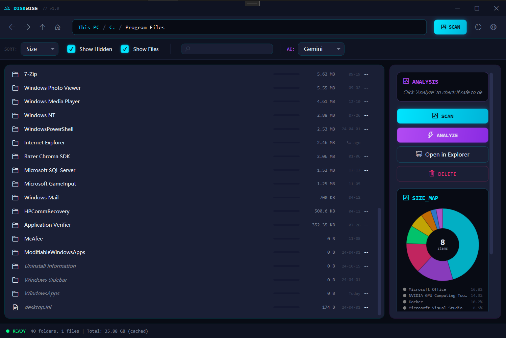
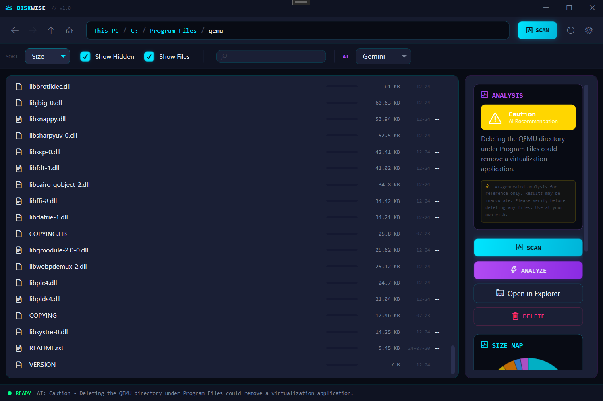

# DiskWise

A modern Windows disk space analyzer with AI-powered cleanup recommendations, built with WPF and .NET 10.

## Screenshots

| Folder Browser with SIZE_MAP | AI Analysis (Caution) |
|---|---|
|  |  |

## Features

### Disk Scanning & Visualization
- High-performance recursive directory scanning with parallel processing
- Interactive donut pie chart (SIZE_MAP) showing folder/file size distribution
- Top space consumers ranking and file type breakdown
- Clickable pie chart slices for quick navigation
- Persistent scan cache with configurable expiration

### AI-Powered Analysis
- Safety assessment for file/folder deletion (Safe / Caution / Danger)
- **LM Studio** integration for local LLM inference
- **Google Gemini** integration via OAuth
- Context-aware advice based on folder type and contents

### Navigation & File Operations
- Explorer-style navigation with back/forward/up history
- Breadcrumb path navigation
- Move to Recycle Bin or permanent delete
- Open in Windows Explorer
- Real-time search within scanned directories

### User Interface
- Cyberpunk glassmorphism theme with neon accents
- Custom title bar with window chrome
- Glassmorphism settings overlay
- Bilingual support: English and Simplified Chinese

## Tech Stack

| Component | Technology |
|-----------|-----------|
| Framework | .NET 10.0 (Windows) |
| UI | WPF (Windows Presentation Foundation) |
| Architecture | MVVM (CommunityToolkit.Mvvm 8.4.0) |
| HTTP | Microsoft.Extensions.Http 9.0.0 |
| Language | C# 13 |

## Getting Started

### Prerequisites

- [.NET 10.0 SDK](https://dotnet.microsoft.com/download) or later
- Windows 10 or later
- (Optional) [LM Studio](https://lmstudio.ai/) for local AI analysis

### Build & Run

```bash
git clone https://github.com/your-username/DiskWise.git
cd DiskWise
dotnet run
```

### AI Setup (Optional)

**LM Studio (Local)**
1. Install and launch LM Studio
2. Load a model and start the local server (default: `http://localhost:1234`)
3. In DiskWise, select "LM Studio" as the AI provider in the toolbar

**Google Gemini (Cloud)**
1. Select "Gemini" as the AI provider
2. Complete OAuth authentication when prompted

## Project Structure

```
DiskWise/
├── Models/
│   ├── FileSystemItem.cs      # File/folder data model
│   ├── AppSettings.cs         # Application settings
│   ├── AIAdvice.cs            # AI recommendation model
│   └── LMStudioModel.cs      # LM Studio API types
├── ViewModels/
│   └── MainViewModel.cs       # Main MVVM ViewModel
├── Services/
│   ├── DiskScanService.cs     # Recursive disk scanner
│   ├── FileOperationService.cs# Delete, recycle, open operations
│   ├── LMStudioService.cs     # Local LLM API client
│   ├── GeminiService.cs       # Google Gemini API client
│   ├── NavigationService.cs   # Back/forward navigation
│   ├── ScanCacheService.cs    # Persistent scan caching
│   └── SettingsService.cs     # Settings persistence
├── Controls/
│   └── PieChartControl.cs     # Custom donut chart control
├── Converters/
│   └── SizeToStringConverter.cs # WPF value converters
├── Resources/
│   ├── Styles.xaml            # Cyberpunk theme styles
│   ├── Strings.en-US.xaml     # English strings
│   └── Strings.zh-CN.xaml     # Chinese strings
├── MainWindow.xaml            # Main UI layout
└── MainWindow.xaml.cs         # Code-behind event handlers
```

## Data Storage

| Data | Location |
|------|----------|
| Settings | `%APPDATA%\DiskWise\settings.json` |
| Scan Cache | `%APPDATA%\DiskWise\scan-cache\` |

## License

MIT
